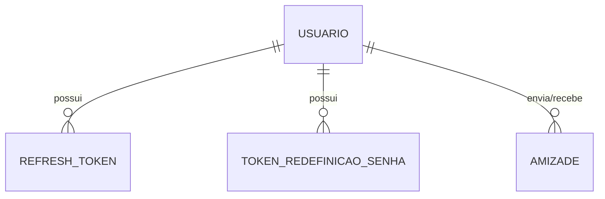
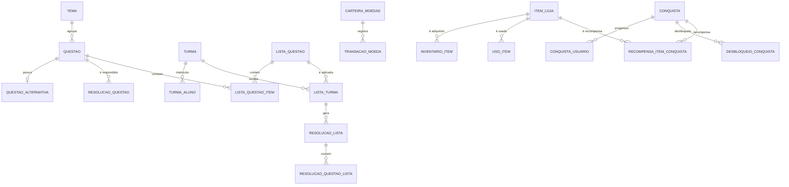

# Banco de Dados

Dois bancos **PostgreSQL** independentes, um por serviço, modelados com **Prisma**. Não há chave estrangeira entre bancos: IDs de usuário no Quiz DB são referências externas.

## Auth DB (Usuario-Service)

| Modelo | Descrição |
|---|---|
| `Usuario` | Dados pessoais, `perfil`, `status`, `visivel`, dados acadêmicos (aluno) e institucionais (professor) |
| `RefreshToken` | Tokens de sessão, com expiração e revogação |
| `TokenRedefinicaoSenha` | Token de uso único para recuperação de senha |
| `Amizade` | Relação entre dois usuários com `StatusAmizade` |

| Enum | Valores |
|---|---|
| `PerfilUsuario` | `ALUNO`, `PROFESSOR`, `ADMIN` |
| `StatusUsuario` | `PENDENTE`, `ATIVO`, `INATIVO`, `RECUSADO` |
| `NivelEducacional` | `ENSINO_FUNDAMENTAL` … `DOUTORADO`, `OUTRO` |
| `StatusAmizade` | `PENDENTE`, `ATIVO`, `RECUSADO` |

## Quiz DB (Quiz-Service)

| Domínio | Modelos | Descrição |
|---|---|---|
| Conteúdo | `Tema`, `Questao`, `QuestaoAlternativa` | Questões com tipo, dificuldade, taxonomia de Bloom, origem, região anatômica, imagem e versionamento (`questaoOriginalId`) |
| Quiz | `ResolucaoQuestao` | Respostas do aluno no quiz livre |
| Turmas | `Turma`, `TurmaAluno` | Turmas do professor e matrícula de alunos |
| Listas | `ListaQuestao`, `ListaQuestaoItem`, `ListaTurma`, `ResolucaoLista`, `ResolucaoQuestaoLista` | Listas ordenadas, aplicadas a turmas com prazo e gabarito; resolução com autosave e submissão |
| Economia | `CarteiraMoedas`, `TransacaoMoeda` | Saldo e extrato de moedas |
| Loja e avatar | `ItemLoja`, `InventarioItem`, `UsoItem` | Cosméticos (avatar, rosto, cabelo, moldura, título, fundo) e consumíveis (dica, potencializador) |
| Conquistas | `Conquista`, `ConquistaUsuario`, `DesbloqueioConquista`, `RecompensaItemConquista` | Progresso, desbloqueio por tier e itens de recompensa |

| Enum | Valores |
|---|---|
| `TipoQuestao` | `MULTIPLA_ESCOLHA`, `CERTO_ERRADO` |
| `Dificuldade` | `FACIL`, `MEDIA`, `DIFICIL` |
| `TaxonomiaBloom` | `LEMBRAR`, `COMPREENDER`, `APLICAR`, `ANALISAR`, `AVALIAR`, `CRIAR` |
| `OrigemQuestao` | `LIVRO`, `PROVA_ANTERIOR`, `GERADA_POR_IA`, `ELABORADA_POR_PROFESSOR` |
| `FonteMoeda` | `ACERTO_QUESTAO`, `DESBLOQUEIO_CONQUISTA`, `COMPRA_ITEM`, `USO_POTENCIALIZADOR` |
| `TipoItemLoja` | `ICONE_PERFIL`, `AVATAR`, `TITULO`, `PLANO_FUNDO`, `MOLDURA`, `ROSTO`, `CABELO`, `DICA`, `POTENCIALIZADOR` |
| `TipoConquista` | `STREAK_ACERTOS`, `TOTAL_ACERTOS`, `TOTAL_ACERTOS_TEMA`, `PERCENTUAL_ACERTO_TEMA` |
| `TierConquista` | `BRONZE`, `PRATA`, `OURO` |
| `StatusResolucaoLista` | `EM_ANDAMENTO`, `SUBMETIDA` |

## Armazenamento de arquivos

Imagens de questões e de itens ficam no **MinIO** (compatível com S3). O banco guarda apenas a URL (`Questao.urlImagem`, `ItemLoja.imagemUrl`).

## Histórico de Versão

| Data | Versão | Descrição | Autor(es) |
| :--- | :--- | :--- | :--- |
| 28/09/2026 | 1.0 | Modelo de dados de 2026.2 a partir dos schemas Prisma | [Henrique Carvalho](https://github.com/henriquecarv3), [Caio Habibe](https://github.com/CaioHabibe), [João Lucas](https://github.com/jlucasiqueira), [Rafael Melo](https://github.com/rmatuda) |