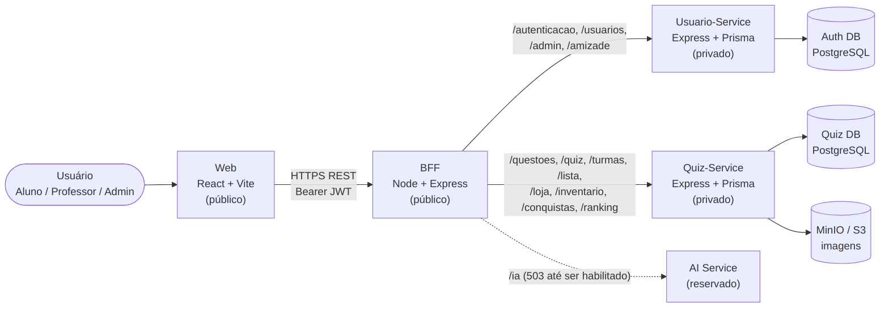
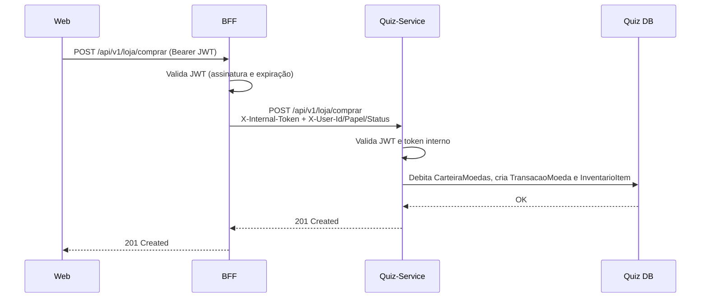

# Visão Geral da Arquitetura

O AnatoQuizUp é uma plataforma web gamificada para o ensino de anatomia radiológica. A arquitetura é composta por **microsserviços com um BFF (Backend for Frontend)**: o Frontend conversa apenas com o BFF, que é o único ponto público da camada de serviços e encaminha cada requisição ao serviço de domínio responsável.

> Este documento evolui a arquitetura definida pela equipe de 2026.1 ([documentação original](https://fga-eps-mds.github.io/2026-1-AnatoQuizUp-Doc/)), atualizada para os domínios desenvolvidos em 2026.2: loja, inventário, avatar, conquistas, ranking e perfil social.

## Diagrama geral

## Componentes

| Componente | Exposição | Responsabilidade |
|---|---|---|
| **Web** | Pública | Telas, formulários, navegação e estado de autenticação do cliente. Acessa somente o BFF. |
| **BFF** | Pública | Valida o JWT na borda, injeta `X-Internal-Token` e headers `X-User-*`, faz proxy para os serviços e **agrega dados** de mais de um serviço (ranking, perfil social). Não possui banco. |
| **Usuario-Service** | Privada | Cadastro, login, sessão (refresh token), recuperação de senha, administração de usuários e amizades. |
| **Quiz-Service** | Privada | Questões e temas, quiz, turmas, listas de exercícios, gamificação (moedas, loja, inventário, conquistas, ranking), dashboards e geração de PDF. |
| **AI Service** | Privada (reservado) | Roteamento já previsto no BFF (`/ia`); responde `503` enquanto o serviço não for habilitado. |

## Perfis de acesso

| Perfil | Principais funcionalidades |
|---|---|
| **Aluno** | Responder quiz, resolver listas das turmas, acompanhar histórico e desempenho, ganhar moedas, comprar itens, personalizar avatar, conquistas, ranking e amigos |
| **Professor** | Banco de questões, criação de listas, gestão de turmas, dashboard da turma e ranking |
| **Administrador** | Gestão de usuários (ativação/aprovação de professores) |

## Telas do Frontend

| Perfil | Rotas |
|---|---|
| Público | `/login`, `/cadastro`, `/professor/cadastro`, `/esqueci-senha`, `/redefinir-senha` |
| Aluno | `/aluno/home`, `/aluno/quiz/escolha`, `/aluno/quiz/responder`, `/aluno/historico`, `/aluno/turmas`, `/aluno/turmas/:turmaId/listas/:listaId`, `/aluno/dashboard`, `/aluno/ranking`, `/aluno/conquistas`, `/aluno/loja`, `/aluno/perfil` (+ `/editar`, `/avatar`, `/personalizar`), `/aluno/amigos`, `/aluno/amigos/:id` |
| Professor | `/professor/home`, `/professor/questoes`, `/professor/criar-questao`, `/professor/lista`, `/turmas`, `/turmas/:id`, `/professor/ranking` |
| Administrador | `/admin/home`, `/admin/dashboard` |

## Fluxo de uma requisição autenticada

## Documentos relacionados

- [Tecnologias](tecnologias.md)
- [Decisões Arquiteturais](decisoes.md)
- [Banco de Dados](banco-de-dados.md)
- [Endpoints](endpoints.md)

## Histórico de Versão

| Data | Versão | Descrição | Autor(es) |
| :--- | :--- | :--- | :--- |
| 28/09/2026 | 1.0 | Criação do documento de arquitetura de 2026.2, com base na documentação de 2026.1 | [Henrique Carvalho](https://github.com/henriquecarv3), [Caio Habibe](https://github.com/CaioHabibe), [João Lucas](https://github.com/jlucasiqueira), [Rafael Melo](https://github.com/rmatuda) |