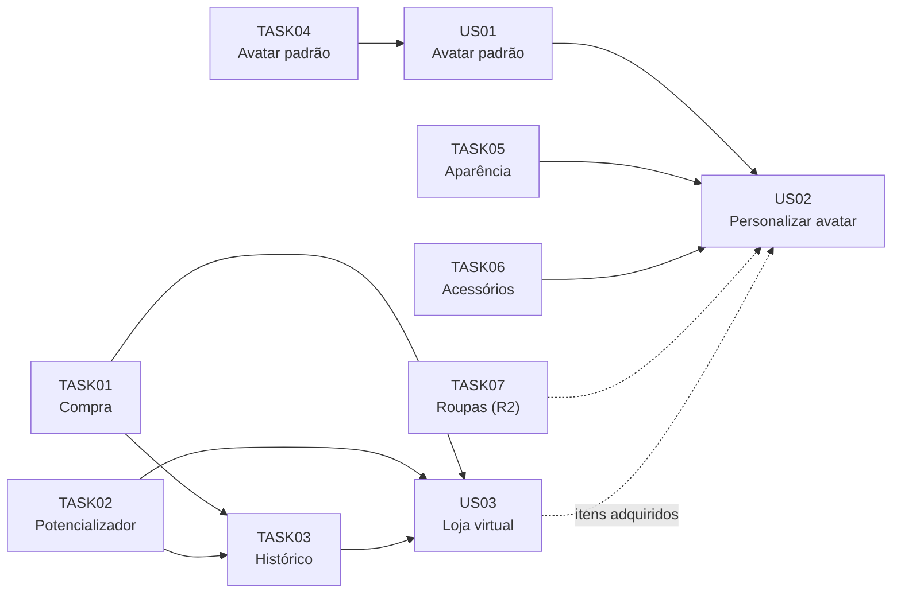

# Backlog — Release Major 1

## Visão geral

A Release Major 1 entrega a base de **gamificação visual** do AnatoQuizUp: a identidade do estudante por meio do **avatar** e a evolução da **loja virtual** com confirmação de compra, uso de potencializadores e histórico.

| Aspecto | Valor |
|---|---|
| Período | 17/08/2026 a 28/09/2026 |
| Épico | EP01 — Gamificação e identidade do estudante |
| Persona atendida | Estudante |
| Histórias de usuário | 3 (1 concluída, 2 parcialmente concluídas) |
| Tarefas técnicas | 12 |
| Repositórios | Web, BFF, Quiz-Service, Usuario-Service, Doc |
| Base herdada | Loja, inventário, conquistas e ranking implementados em 2026.1; a R1 evolui essa base |
| Protótipos | [Figma — telas da R1](COLOCAR_LINK_DO_FIGMA) |

## Escopo da release

### Incluído

- Avatar padrão (cérebro) atribuído a todo estudante e página **Meu avatar**.
- Personalização do avatar: **Aparência** e **Acessórios**.
- Loja virtual: confirmação de compra, controle de quantidade e mensagens de resultado.
- Utilização de itens potencializadores com validação e consumo.
- Histórico unificado de compras e utilizações.
- Ambiente de homologação.

### Fora de escopo

| Item | Motivo | Destino |
|---|---|---|
| Pontos de experiência (XP) | Esforço maior que o previsto; o time priorizou concluir loja e avatar ponta a ponta | R2 (US04) |
| Aba "Roupas" do avatar | Priorizou-se concluir Aparência e Acessórios; a aba ficou desabilitada na interface | R2 (issue #33) |
| Item "Congelar ofensiva" | Depende de um sistema de ofensiva diária, ainda não implementado | Backlog |

## Dependências



---

## Product Backlog

### US01 — Avatar padrão

**Como** estudante, **quero** possuir um avatar padrão **para** ter uma identidade na plataforma desde o primeiro acesso.

| Prioridade | Status | Repositórios | Issue | Protótipo |
|---|---|---|---|---|
| Must | Parcial (3/5 tarefas; ilustrações em andamento) | Web, Usuario-Service, BFF | [#27](https://github.com/fga-eps-mds/2026-2-AnatoQuizUp-Doc/issues/27) | [Figma](COLOCAR_LINK_DA_TELA) |

#### Critérios de aceitação

```gherkin
Cenário: Novo usuário recebe um avatar padrão
  Dado que um novo usuário concluiu o cadastro
  Quando ele acessa a plataforma pela primeira vez
  Então um avatar padrão deve ser atribuído automaticamente

Cenário: Avatar padrão é exibido no perfil
  Dado que o usuário ainda não personalizou seu avatar
  Quando ele acessa seu perfil ou aparece em outras telas
  Então o avatar padrão deve ser exibido

Cenário: Avatar padrão permanece até ser personalizado
  Dado que o usuário possui apenas o avatar padrão
  Quando ele faz login em sessões futuras
  Então o mesmo avatar padrão deve continuar sendo exibido

Cenário: Avatar padrão é substituído após personalização
  Dado que o usuário possui o avatar padrão
  Quando ele personaliza e salva um novo avatar
  Então o avatar personalizado passa a representá-lo
```

### US02 — Personalizar avatar

**Como** estudante, **quero** personalizar a aparência, os acessórios e as roupas do meu avatar **para** me sentir representado e exibir os itens que conquistei.

| Prioridade | Status | Repositórios | Issue | Protótipo |
|---|---|---|---|---|
| Must | Parcial: Aparência e Acessórios concluídos; Roupas adiada para a R2 | Web, Quiz-Service, BFF | [#26](https://github.com/fga-eps-mds/2026-2-AnatoQuizUp-Doc/issues/26) | [Figma](COLOCAR_LINK_DA_TELA) |

#### Critérios de aceitação

```gherkin
Cenário: Exibir opções de personalização
  Dado que o estudante acessa a página de personalização
  Quando ele seleciona uma aba (Aparência ou Acessórios)
  Então devem ser exibidas as opções daquela categoria

Cenário: Pré-visualizar um item
  Dado que o estudante está em uma aba de personalização
  Quando ele seleciona um item disponível
  Então a pré-visualização do avatar é atualizada

Cenário: Salvar a personalização
  Dado que o estudante selecionou os itens desejados
  Quando ele confirma a personalização
  Então as alterações são salvas e exibidas nos próximos acessos

Cenário: Item não adquirido
  Dado que o estudante está em uma aba de personalização
  Quando ele tenta selecionar um item que ainda não possui
  Então a seleção é impedida e o sistema indica que o item está na loja
```

### US03 — Loja virtual

**Como** estudante, **quero** comprar e utilizar itens na loja virtual **para** usar minhas moedas para potencializar meu aprendizado.

| Prioridade | Status | Repositórios | Issues | Protótipo |
|---|---|---|---|---|
| Must | Concluída | Web, BFF, Quiz-Service | [#28](https://github.com/fga-eps-mds/2026-2-AnatoQuizUp-Doc/issues/28), [#25](https://github.com/fga-eps-mds/2026-2-AnatoQuizUp-Doc/issues/25) | [Figma](COLOCAR_LINK_DA_TELA) |

#### Critérios de aceitação

```gherkin
Cenário: Comprar item com saldo suficiente
  Dado que o estudante possui moedas suficientes
  Quando ele confirma a compra de um item
  Então o item é adicionado ao inventário
  E o saldo é descontado uma única vez
  E a compra aparece no histórico

Cenário: Comprar item sem saldo suficiente
  Dado que o estudante não possui moedas suficientes
  Quando ele tenta comprar o item
  Então saldo e inventário não são alterados
  E uma mensagem de saldo insuficiente é exibida

Cenário: Utilizar um potencializador
  Dado que o estudante possui um potencializador no inventário
  Quando ele confirma o uso e as condições de uso são atendidas
  Então o efeito é aplicado
  E a quantidade do item diminui em uma unidade
  E o uso aparece no histórico

Cenário: Utilização inválida
  Dado que o item está ausente, sem unidades ou fora das condições de uso
  Quando o estudante tenta utilizá-lo
  Então nada é alterado e o motivo é informado
```

---

## Project Backlog

| ID | Tarefa | US | Repositórios | Issue | Status |
|---|---|---|---|---|---|
| TASK01 | Comprar item na loja, ponta a ponta | US03 | Web, Quiz-Service | [#35](https://github.com/fga-eps-mds/2026-2-AnatoQuizUp-Doc/issues/35) | Concluída |
| TASK02 | Utilizar potencializador, ponta a ponta | US03 | Web, Quiz-Service | [#38](https://github.com/fga-eps-mds/2026-2-AnatoQuizUp-Doc/issues/38) | Concluída |
| TASK03 | Integrar loja, histórico e qualidade | US03 | Web, BFF, Quiz-Service | [#40](https://github.com/fga-eps-mds/2026-2-AnatoQuizUp-Doc/issues/40) | Concluída |
| TASK04 | Construir o avatar padrão e a página "Meu avatar" | US01 | Web, BFF, Usuario-Service | [#31](https://github.com/fga-eps-mds/2026-2-AnatoQuizUp-Doc/issues/31) | Concluída |
| TASK05 | Página de personalização — Aparência | US02 | Web, Quiz-Service | [#32](https://github.com/fga-eps-mds/2026-2-AnatoQuizUp-Doc/issues/32) | Concluída |
| TASK06 | Página de personalização — Acessórios | US02 | Web | [#34](https://github.com/fga-eps-mds/2026-2-AnatoQuizUp-Doc/issues/34) | Concluída |
| TASK07 | Página de personalização — Roupas | US02 | Web, Quiz-Service | [#33](https://github.com/fga-eps-mds/2026-2-AnatoQuizUp-Doc/issues/33) | Adiada para a R2 |
| TASK08 | Página de personalização do avatar (estrutura) | US02 | Web | [#30](https://github.com/fga-eps-mds/2026-2-AnatoQuizUp-Doc/issues/30) | Em andamento |
| TASK09 | Definir ilustrações do avatar | US01, US02 | Web | [#29](https://github.com/fga-eps-mds/2026-2-AnatoQuizUp-Doc/issues/29) | Em andamento |
| TASK10 | Criar ambiente de homologação | Todas | Quiz-Service, infraestrutura | [#41](https://github.com/fga-eps-mds/2026-2-AnatoQuizUp-Doc/issues/41) | Concluída |
| TASK11 | Documento de arquitetura | — | Doc | [#53](https://github.com/fga-eps-mds/2026-2-AnatoQuizUp-Doc/issues/53) | Concluída |
| TASK12 | Backlog do produto | — | Doc | [#6](https://github.com/fga-eps-mds/2026-2-AnatoQuizUp-Doc/issues/6) | Em andamento |

### Critérios de conclusão

**TASK01 — Compra ponta a ponta**
- [x] Catálogo, preço e saldo exibidos na loja.
- [x] Compra enviada somente após confirmação, com controle de quantidade.
- [x] Débito único do saldo e inclusão no inventário.
- [x] Modais de resultado para sucesso e saldo insuficiente.

**TASK02 — Uso de potencializador**
- [x] Item utilizável com efeito e condições de uso definidos.
- [x] Ativação do potencializador pelo inventário, após confirmação.
- [x] Consumo de uma unidade somente após sucesso.
- [x] Registro da utilização para o histórico.

**TASK03 — Histórico e qualidade**
- [x] Endpoint `GET /api/v1/loja/meu-historico` com compras e usos do usuário autenticado.
- [x] O BFF usa a identidade do JWT, ignorando identidade enviada pelo cliente.
- [x] Aba **Histórico** na loja.
- [x] Testes de contrato (frontend × backend) e ponta a ponta, sem regressão nos cosméticos.

**TASK04 — Avatar padrão**
- [x] Cérebro exibido como avatar padrão no perfil e na barra lateral.
- [x] Endpoint autenticado `GET /api/v1/usuarios/meu-avatar`.
- [x] Página **Meu avatar** acessível por Perfil → Meu avatar.
- [x] Acesso à personalização pelo ícone de edição (caneta).

**TASK05 — Aparência**
- [x] Personalização da cor do cérebro e do cabelo.
- [x] Itens de rosto e cabelo disponíveis no catálogo da loja.

**TASK06 — Acessórios**
- [x] Aba **Acessórios** na personalização do avatar.
- [x] Equipar e desequipar acessórios do inventário.

**TASK10 — Homologação**
- [x] Seed de dados para o ambiente de homologação, incluindo itens utilizáveis.
- [x] Armazenamento de imagens opcional no ambiente de homologação.

**TASK12 — Backlog do produto**
- [x] Épicos derivados da Lean Inception, com tabela de cobertura.
- [x] Histórias no formato Como / Quero / Para, priorizadas com MoSCoW.
- [x] Critérios de aceitação das histórias da R1.
- [ ] Validação por todos os membros do grupo.

## Rastreabilidade

| Item | Pull Requests |
|---|---|
| US01 / TASK04 — Avatar padrão | [Web #2](https://github.com/fga-eps-mds/2026-2-AnatoQuizUp-Web/pull/2) · [BFF #2](https://github.com/fga-eps-mds/2026-2-AnatoQuizUp-BFF/pull/2) · [Usuario-Service #2](https://github.com/fga-eps-mds/2026-2-AnatoQuizUp-Usuario-Service/pull/2) · [Web #8](https://github.com/fga-eps-mds/2026-2-AnatoQuizUp-Web/pull/8) |
| TASK05 — Aparência | [Web #5](https://github.com/fga-eps-mds/2026-2-AnatoQuizUp-Web/pull/5) · [Quiz-Service #4](https://github.com/fga-eps-mds/2026-2-AnatoQuizUp-Quiz-Service/pull/4) |
| TASK06 — Acessórios | [Web #7](https://github.com/fga-eps-mds/2026-2-AnatoQuizUp-Web/pull/7) |
| TASK01 — Compra | [Web #3](https://github.com/fga-eps-mds/2026-2-AnatoQuizUp-Web/pull/3) · [Quiz-Service #2](https://github.com/fga-eps-mds/2026-2-AnatoQuizUp-Quiz-Service/pull/2) |
| TASK02 — Potencializador | [Web #4](https://github.com/fga-eps-mds/2026-2-AnatoQuizUp-Web/pull/4) · [Quiz-Service #3](https://github.com/fga-eps-mds/2026-2-AnatoQuizUp-Quiz-Service/pull/3) |
| TASK03 — Histórico e qualidade | [Web #6](https://github.com/fga-eps-mds/2026-2-AnatoQuizUp-Web/pull/6) · [Quiz-Service #5](https://github.com/fga-eps-mds/2026-2-AnatoQuizUp-Quiz-Service/pull/5) · [BFF #3](https://github.com/fga-eps-mds/2026-2-AnatoQuizUp-BFF/pull/3) |
| TASK10 — Homologação | [Quiz-Service #6](https://github.com/fga-eps-mds/2026-2-AnatoQuizUp-Quiz-Service/pull/6) · [Quiz-Service #7](https://github.com/fga-eps-mds/2026-2-AnatoQuizUp-Quiz-Service/pull/7) · [Quiz-Service #9](https://github.com/fga-eps-mds/2026-2-AnatoQuizUp-Quiz-Service/pull/9) |

## Histórico de Versão

| Data | Versão | Descrição | Autor(es) |
| :--- | :--- | :--- | :--- |
| 28/09/2026 | 1.0 | Detalhamento do Product Backlog e Project Backlog da Release Major 1 | [Henrique Carvalho](https://github.com/henriquecarv3), [Rafael Melo](https://github.com/rmatuda) |