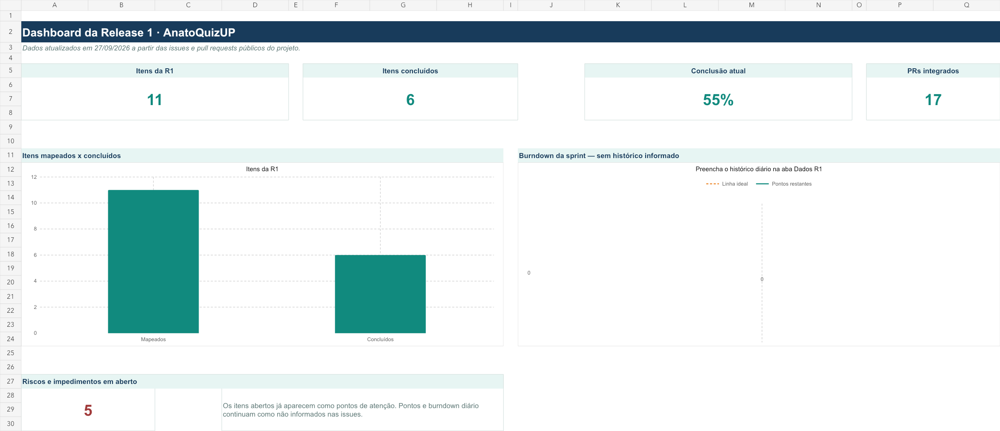

# Dashboard da Release 1

Atualizado em **27/09/2026**. A R1 possui **11 itens mapeados**, sendo **6 concluídos (55%)**, além de **17 pull requests integrados**.

[Baixar a planilha completa](assets/dashboard-r1-anatoquizup.xlsx){ .md-button .md-button--primary }

> **Observação:** as estimativas em pontos e o histórico diário do burndown ainda não foram registrados pela equipe. Por isso, esses campos permanecem sem dados.

## Dashboard interativo (Streamlit)

Métricas técnicas da R1: cobertura de testes por repositório (linhas, instruções, 
funções e ramificações), comparada com a meta de 85%. Os dados vêm dos arquivos em 
`analytics-raw-data/` deste repositório.

[Abrir o dashboard no Streamlit](https://2026-2-anatoquizup-doc.streamlit.app/){ .md-button .md-button--primary }

## Origem dos dados

Os dados foram consolidados em **27/09/2026** a partir das informações públicas dos repositórios do projeto.

| Indicador | Como foi obtido | Fonte |
| --------- | --------------- | ----- |
| Itens da R1: **11** | Contagem das issues `#6`, `#8`, `#9`, `#31`, `#32`, `#33`, `#34`, `#35`, `#38`, `#40` e `#41` | [Issues do repositório de documentação](https://github.com/fga-eps-mds/2026-2-AnatoQuizUp-Doc/issues) |
| Itens concluídos: **6** | Issues da R1 que estavam fechadas no dia da atualização | [Issues do repositório de documentação](https://github.com/fga-eps-mds/2026-2-AnatoQuizUp-Doc/issues?q=is%3Aissue+is%3Aclosed) |
| Itens em aberto: **5** | Issues da R1 que continuavam abertas e foram tratadas como pontos de atenção | [Issues abertas do repositório de documentação](https://github.com/fga-eps-mds/2026-2-AnatoQuizUp-Doc/issues?q=is%3Aissue+is%3Aopen) |
| Progresso: **55%** | Cálculo de `6 concluídos ÷ 11 itens × 100` | Fórmula automática da planilha |
| PRs integrados: **17** | Soma dos PRs integrados: Web (7), BFF (3), Quiz Service (5) e Usuário Service (2) | [Web](https://github.com/fga-eps-mds/2026-2-AnatoQuizUp-Web/pulls?q=is%3Apr+is%3Amerged), [BFF](https://github.com/fga-eps-mds/2026-2-AnatoQuizUp-BFF/pulls?q=is%3Apr+is%3Amerged), [Quiz Service](https://github.com/fga-eps-mds/2026-2-AnatoQuizUp-Quiz-Service/pulls?q=is%3Apr+is%3Amerged) e [Usuário Service](https://github.com/fga-eps-mds/2026-2-AnatoQuizUp-Usuario-Service/pulls?q=is%3Apr+is%3Amerged) |

Os cinco itens que ainda estavam abertos foram apresentados no painel como pontos de atenção. As informações podem ser atualizadas pela equipe conforme houver mudanças no [quadro do ZenHub](https://app.zenhub.com/workspaces/2026-2-anatoquizup-62c22d94edb2f3001765c363/board).

## Histórico de versão

| Versão | Data | Descrição | Elaboradora |
| :-----: | :--: | --------- | ----------- |
| 1.0 | 27/09/2026 | Criação do dashboard da Release 1 | [Letícia Torres Soares Martins](https://github.com/leticiatmartins) |
| 1.1 | 28/09/2026 | Adição do link para o dashboard interativo em Streamlit | [Rafael Matuda](https://github.com/rmatuda) |