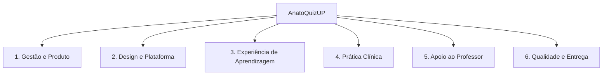
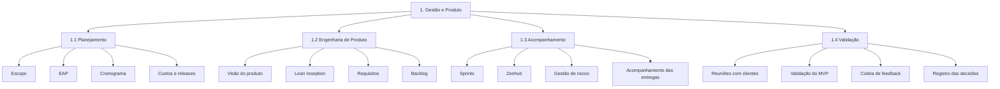
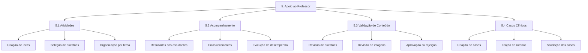
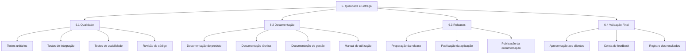

# Estrutura Analítica do Projeto

## Introdução

A Estrutura Analítica do Projeto organiza hierarquicamente as entregas necessárias para o desenvolvimento do AnatoQuizUP. Ela foi construída com base na visão do produto, na Lean Inception e nas necessidades identificadas junto aos clientes.

A proposta do MVP, o custo e o cronograma ainda aguardam validação. Por isso, a EAP poderá ser atualizada de acordo com as decisões tomadas pela equipe e pelos clientes.

## Visão geral da EAP

## 1. Gestão e Produto

## 2. Design e Plataforma

```mermaid
flowchart TB
    A["2. Design e Plataforma"]

    A --> B["2.1 Experiência do Usuário"]
    A --> C["2.2 Arquitetura"]
    A --> D["2.3 Dados"]
    A --> E["2.4 Infraestrutura"]

    B --> B1["Identidade visual"]
    B --> B2["Fluxos de utilização"]
    B --> B3["Protótipos"]
    B --> B4["Acessibilidade"]

    C --> C1["Arquitetura do sistema"]
    C --> C2["Interface multiplataforma"]
    C --> C3["Serviços da aplicação"]
    C --> C4["Integrações com IA"]

    D --> D1["Banco de questões"]
    D --> D2["Resultados dos quizzes"]
    D --> D3["Dados de gamificação"]
    D --> D4["Casos clínicos"]

    E --> E1["Ambiente de desenvolvimento"]
    E --> E2["Ambiente de homologação"]
    E --> E3["Ambiente de produção"]
    E --> E4["Publicação"]
```

## 3. Experiência de Aprendizagem

```mermaid
flowchart TB
    A["3. Experiência de Aprendizagem"]

    A --> B["3.1 Quizzes"]
    A --> C["3.2 Gamificação"]
    A --> D["3.3 Inteligência Artificial"]
    A --> E["3.4 Acompanhamento"]

    B --> B1["Banco gratuito de questões"]
    B --> B2["Questões com imagens"]
    B --> B3["Correção e explicações"]
    B --> B4["Revisão dos erros"]

    C --> C1["Pontos de experiência"]
    C --> C2["Níveis"]
    C --> C3["Avatares"]
    C --> C4["Moedas, loja e ranking"]

    D --> D1["Geração de questões"]
    D --> D2["Chatbot educacional"]
    D --> D3["Explicações personalizadas"]
    D --> D4["Validação profissional"]

    E --> E1["Histórico de atividades"]
    E --> E2["Desempenho individual"]
    E --> E3["Identificação de dificuldades"]
    E --> E4["Recomendação de conteúdos"]
```

## 4. Prática Clínica

```mermaid
flowchart TB
    A["4. Prática Clínica"]

    A --> B["4.1 Casos Clínicos"]
    A --> C["4.2 Paciente Virtual"]
    A --> D["4.3 Simulação OSCE"]
    A --> E["4.4 Avaliação"]

    B --> B1["Definição do cenário"]
    B --> B2["Informações do paciente"]
    B --> B3["Roteiro estruturado"]
    B --> B4["Validação pelo professor"]

    C --> C1["Apresentação do paciente"]
    C --> C2["Perguntas do estudante"]
    C --> C3["Respostas do paciente"]
    C --> C4["Manutenção do contexto"]

    D --> D1["Seleção do caso"]
    D --> D2["Execução da consulta"]
    D --> D3["Registro das observações"]
    D --> D4["Hipótese final"]

    E --> E1["Análise das perguntas"]
    E --> E2["Comparação com o roteiro"]
    E --> E3["Avaliação da hipótese"]
    E --> E4["Feedback ao estudante"]
```

## 5. Apoio ao Professor

## 6. Qualidade e Entrega

## Itens fora do escopo atual

Não fazem parte do escopo atual:

* Cadastro de usuários.
* Autenticação de usuários.
* Banco pago de questões.
* Substituição das avaliações realizadas pelos professores.
* Publicação de conteúdo sem validação profissional.
* Diagnóstico médico realizado pela plataforma.
* Substituição das atividades práticas presenciais.

## Evoluções futuras

Após a validação do MVP, poderão ser consideradas:

* Geração de imagens com inteligência artificial.
* Trilhas de estudo personalizadas.
* Adaptação automática da dificuldade.
* Recursos colaborativos entre estudantes.
* Relatórios avançados para professores.
* Expansão para outras áreas da saúde.

## Histórico de Versão

| Data | Versão | Descrição | Autor(es) |
| :---: | :---: | --- | --- |
| 14/09/2026 | 1.0 | Criação da Estrutura Analítica do Projeto do AnatoQuizUP | Leticia |
| 14/09/2026 | 1.1 | Revisão textual e validação do conteúdo | [Nome do revisor](https://github.com/usuario) |