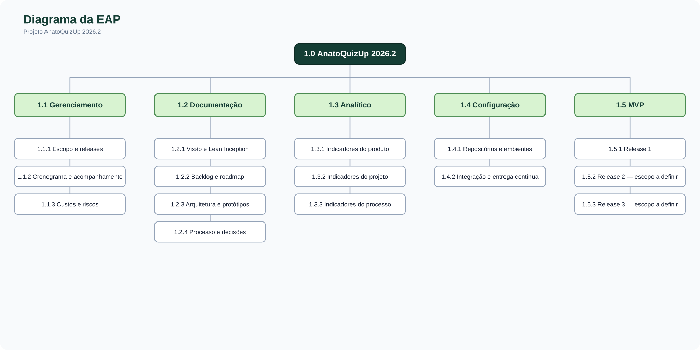
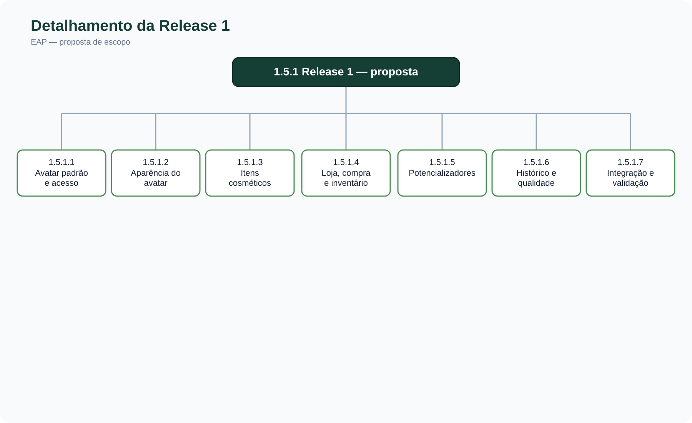

# Estrutura Analítica do Projeto (EAP) — AnatoQuizUp 2026.2

| Campo | Informação |
| --- | --- |
| Projeto | AnatoQuizUp — continuidade 2026.2 |
| Versão | 1.0 — proposta para validação da equipe |
| Data | 27/09/2026 |
| Responsável | Equipe AnatoQuizUp 2026.2 |
| Referência | [EAP da equipe 2026.1](https://fga-eps-mds.github.io/2026-1-AnatoQuizUp-Doc/processo/eap/) |

## 1. Objetivo

Esta EAP organiza as entregas do projeto AnatoQuizUp em partes menores e verificáveis. Ela serve de referência para relacionar escopo, backlog, planejamento das releases e acompanhamento. Cada código identifica uma entrega ou um pacote de trabalho; atividades como criar um endpoint, abrir uma PR e executar uma reunião devem ser detalhadas no backlog ou cronograma, sem substituir o entregável correspondente na EAP.

A estrutura mantém os cinco ramos da documentação de 2026.1: gerenciamento, documentação, analítico, configuração e MVP. Os ramos descrevem o trabalho **desta equipe**. Funcionalidades já existentes no produto entram apenas quando houver adaptação, integração, validação ou evolução no semestre atual. As releases R2 e R3 permanecem como espaços de planejamento: as [issues R2](https://github.com/fga-eps-mds/2026-2-AnatoQuizUp-Doc/issues/21) e [R3](https://github.com/fga-eps-mds/2026-2-AnatoQuizUp-Doc/issues/22) ainda não detalham seu conteúdo.

> **Situação do escopo:** a associação dos pacotes abaixo à R1 é uma **proposta baseada no trabalho recente**, sujeita à validação no roadmap/backlog. A [issue R1](https://github.com/fga-eps-mds/2026-2-AnatoQuizUp-Doc/issues/20) não possui descrição de escopo. A EAP não declara que todas as entregas foram concluídas.

## 2. Diagrama da EAP

O diagrama principal mostra a decomposição do projeto. O segundo amplia a Release 1 para facilitar a leitura na página.

## 3. Dicionário da EAP

O dicionário define o resultado esperado de cada pacote. A evidência indicada é uma forma de verificar a entrega e pode apontar para documentação, issue, PR ou demonstração integrada.

### 1.1 Gerenciamento do projeto

| Código | Pacote | Resultado esperado / evidência |
| --- | --- | --- |
| 1.1.1 | Escopo e releases | Escopo do semestre, limites de cada release e EAP aprovados e alinhados ao backlog. |
| 1.1.2 | Cronograma e acompanhamento | Marcos e acompanhamento das sprints, com registro de planejado versus realizado. |
| 1.1.3 | Custos e riscos | Plano de custos/esforço e matriz de riscos atualizados quando o escopo mudar. |

### 1.2 Documentação

| Código | Pacote | Resultado esperado / evidência |
| --- | --- | --- |
| 1.2.1 | Visão do produto e Lean Inception | Visão, hipóteses, objetivos, personas/jornadas pertinentes e definição do MVP registrados. |
| 1.2.2 | Backlog e roadmap | Épicos, histórias, critérios de aceite e distribuição validada das entregas nas releases. |
| 1.2.3 | Arquitetura e protótipos | Contratos/fluxos entre Web, BFF e serviços; protótipos necessários às funcionalidades priorizadas. |
| 1.2.4 | Processo e decisões | Política de contribuição, metodologia, atas e decisões com justificativa e rastreabilidade. |

### 1.3 Analítico

| Código | Pacote | Resultado esperado / evidência |
| --- | --- | --- |
| 1.3.1 | Indicadores do produto | Definições e apresentação das métricas de uso/valor acordadas pela equipe. Trata-se do acompanhamento do **produto**, não de um dashboard do aluno. |
| 1.3.2 | Indicadores do projeto | Visibilidade do progresso, escopo e marcos das releases. |
| 1.3.3 | Indicadores do processo | Métricas de fluxo e qualidade que a equipe efetivamente acompanhar. |

### 1.4 Configuração

| Código | Pacote | Resultado esperado / evidência |
| --- | --- | --- |
| 1.4.1 | Repositórios e ambientes | Repositórios organizados e instruções reproduzíveis para desenvolvimento e homologação. |
| 1.4.2 | Integração e entrega contínua | Pipelines e configuração de integração dos componentes usados nas entregas do semestre. |

### 1.5 MVP — Release 1

| Código | Pacote | Resultado esperado / evidência |
| --- | --- | --- |
| 1.5.1.1 | Avatar padrão e acesso | Usuário autenticado obtém sua representação inicial pelo fluxo Web → BFF → Usuario-Service, com contrato e tratamento de acesso definidos. A rota de avatar padrão está na [PR do Usuario-Service](https://github.com/fga-eps-mds/2026-2-AnatoQuizUp-Usuario-Service/pull/2); sua integração precisa ser verificada. |
| 1.5.1.2 | Aparência do avatar | Interface de prévia, seleção e salvamento de aparência conforme o contrato efetivo; explicitar se a preferência fica armazenada localmente ou no servidor. A [PR Web #5](https://github.com/fga-eps-mds/2026-2-AnatoQuizUp-Web/pull/5) descreve persistência local por usuário, portanto ela não comprova, por si, persistência no Usuario-Service. |
| 1.5.1.3 | Itens cosméticos | Catálogo e regras de posse/equipamento para rosto e cabelo integrados à aparência. A [PR Quiz-Service #4](https://github.com/fga-eps-mds/2026-2-AnatoQuizUp-Quiz-Service/pull/4) cobre esses tipos; roupas e acessórios não estão incluídos nela. |
| 1.5.1.4 | Loja, compra e inventário | Fluxo de visualização, aquisição e uso de itens com saldo e inventário coerentes, reaproveitando as capacidades existentes e entregas recentes. A [história de loja #28](https://github.com/fga-eps-mds/2026-2-AnatoQuizUp-Doc/issues/28) define os critérios de compra e uso. |
| 1.5.1.5 | Potencializadores | Aplicação de efeitos de itens consumíveis apenas quando as condições forem válidas, com consumo correto da quantidade. Vinculado à [história #28](https://github.com/fga-eps-mds/2026-2-AnatoQuizUp-Doc/issues/28). |
| 1.5.1.6 | Histórico e qualidade | Histórico de compras/usos restrito ao usuário autenticado e evidências de testes dos fluxos de loja. A [issue #40](https://github.com/fga-eps-mds/2026-2-AnatoQuizUp-Doc/issues/40) permanece aberta nesta revisão. |
| 1.5.1.7 | Integração e validação | Fluxos completos demonstráveis, contratos consistentes entre Web/BFF/serviços, revisão das PRs, testes essenciais e aceite da release conforme critérios acordados. |

### 1.5 MVP — Releases futuras

| Código | Pacote | Resultado esperado / evidência |
| --- | --- | --- |
| 1.5.2 | Release 2 — escopo a definir | Incremento e critérios de aceite a serem decompostos após aprovação do roadmap; registrar o conteúdo na [issue R2](https://github.com/fga-eps-mds/2026-2-AnatoQuizUp-Doc/issues/21). |
| 1.5.3 | Release 3 — escopo a definir | Incremento e critérios de aceite a serem decompostos após aprovação do roadmap; registrar o conteúdo na [issue R3](https://github.com/fga-eps-mds/2026-2-AnatoQuizUp-Doc/issues/22). |

Geração de questões/imagens com IA, chatbot de estudo e simulação OSCE pertencem à visão discutida na Lean Inception. A distribuição desses temas em R2/R3 precisa de decisão explícita da equipe e dos usuários; por isso ainda não aparecem como compromissos de uma release específica.

## 4. Limites, critérios de aceite e rastreabilidade

- **Limite da EAP:** cada ramo corresponde às entregas assumidas em 2026.2. Trabalho concluído exclusivamente em 2026.1 é contexto e não deve ser contabilizado novamente como entrega atual.
- **Pacote concluído:** há resultado verificável, critérios de aceite atendidos, integração necessária demonstrada e evidência vinculada no backlog/documentação. PR aberta, isoladamente, não equivale a pacote aceito.
- **Mudanças de escopo:** uma história nova ou alteração de release exige atualização do backlog, do pacote afetado, dos critérios de aceite e do histórico desta página.
- **Regra dos 100%:** os filhos de cada ramo devem cobrir o trabalho assumido pelo pai sem duplicação. Antes da aprovação final, conferir com a equipe se todos os objetivos planejados para R1 estão nos sete pacotes e se R2/R3 receberam escopo suficiente para sua decomposição.
- **Rastreabilidade:** vincular cada história/issue ao código de pacote correspondente; registrar estimativas e responsáveis no backlog, não na árvore da EAP.

## 5. Pendências de validação com a equipe

1. Confirmar se avatar, loja, potencializadores e histórico compõem formalmente a R1 ou se algum pacote pertence a outra release; preencher a [issue R1](https://github.com/fga-eps-mds/2026-2-AnatoQuizUp-Doc/issues/20).
2. Definir o requisito de persistência do avatar: a interface atual descreve armazenamento local, enquanto a rota de avatar padrão ainda não descreve persistência da personalização no serviço.
3. Decidir quando roupas e acessórios, hoje registrados em [issues #33](https://github.com/fga-eps-mds/2026-2-AnatoQuizUp-Doc/issues/33) e [#34](https://github.com/fga-eps-mds/2026-2-AnatoQuizUp-Doc/issues/34), entrarão no escopo de uma release.
4. Distribuir IA, chatbot e OSCE no roadmap aprovado antes de decompor R2/R3.

## 6. Referências

- [EAP AnatoQuizUp 2026.1](https://fga-eps-mds.github.io/2026-1-AnatoQuizUp-Doc/processo/eap/) — referência para a organização em cinco ramos e para o conceito de decomposição por entregas.
- [Backlog e issues AnatoQuizUp 2026.2](https://github.com/fga-eps-mds/2026-2-AnatoQuizUp-Doc/issues) — rastreabilidade das entregas correntes.
- [PR Web #5](https://github.com/fga-eps-mds/2026-2-AnatoQuizUp-Web/pull/5), [PR Quiz-Service #4](https://github.com/fga-eps-mds/2026-2-AnatoQuizUp-Quiz-Service/pull/4), [PR Usuario-Service #2](https://github.com/fga-eps-mds/2026-2-AnatoQuizUp-Usuario-Service/pull/2) e [PR BFF #2](https://github.com/fga-eps-mds/2026-2-AnatoQuizUp-BFF/pull/2) — evidências técnicas consultadas em 27/09/2026.

## 7. Histórico de versão

| Data | Versão | Descrição | Responsável |
| --- | --- | --- | --- |
| 27/09/2026 | 1.0 | Estrutura inicial para 2026.2, dicionário e diagramas; releases futuras pendentes de definição. | Equipe AnatoQuizUp 2026.2 — proposta para revisão |